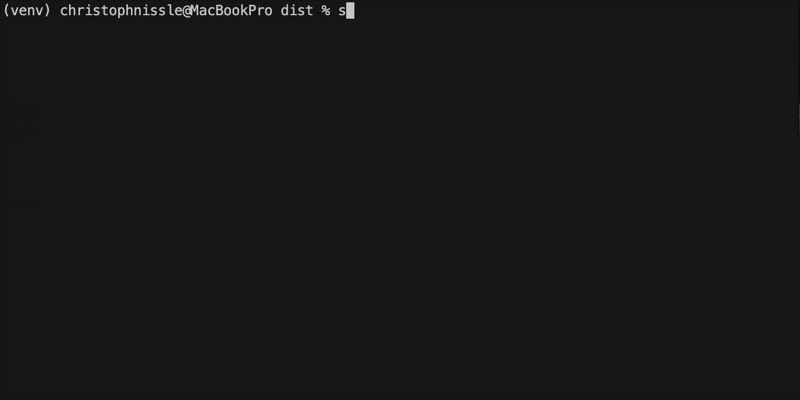

# Shapefile ZIP to GeoJSON Extractor


A user-friendly, interactive command-line tool to inspect a zipped Shapefile, select a specific layer, and export it as a GeoJSON file. The tool automatically handles reading from the `.zip` archive and reprojects the data to WGS 84 (EPSG:4326) for standardized GeoJSON output.

## Key Features

-   **Direct ZIP Reading**: No need to manually unzip your Shapefiles. The tool reads directly from the `.zip` archive.
-   **Interactive Layer Selection**: Automatically lists all available vector layers and provides a clean, interactive prompt for you to choose one.
-   **GeoJSON Export**: Converts the selected layer to GeoJSON, the web standard for geographic data.
-   **CRS Reprojection**: Automatically reprojects data to WGS 84 (EPSG:4326) for maximum compatibility.
-   **User-Friendly CLI**: Uses colored output and clear prompts for a smooth user experience.
-   **Standalone Executable**: Can be bundled into a single executable file that runs without a Python installation.

## Demo

Here is an example of the interactive session:



## Installation

To use this tool, you need Python 3.8+ installed. It's highly recommended to use a virtual environment.

1.  **Clone the repository:**
    ```bash
    git clone https://github.com/DerStoffel/shason.git
    cd shason
    ```

2.  **Create and activate a virtual environment (recommended):**
    ```bash
    # For macOS/Linux
    python3 -m venv venv
    source venv/bin/activate

    # For Windows
    python -m venv venv
    .\venv\Scripts\activate
    ```

3.  **Install the required dependencies:**
    ```bash
    pip install geopandas fiona questionary rich
    ```

## Usage

Run the script from your terminal and provide the path to your zipped Shapefile as the only argument.

```bash
python shason.py /path/to/your/shapefile.zip
```

The tool will then guide you through the following steps:

1.  **Layer Selection**: Use the arrow keys to choose the layer you wish to extract and press `Enter`.
2.  **Filename**: Confirm or edit the default output filename for your GeoJSON file.

## Downloads

You can download the pre-compiled, standalone executables for your operating system directly from the latest GitHub Release. No Python installation is required.

**[➡️ Go to the Latest Release Page](https://github.com/DerStoffel/shason/releases/latest/)**

Or, use the direct links below:

  - [**Download for macOS (Intel/ARM)**](https://github.com/DerStoffel/shason/releases/latest/download/shason_macos)

## Building From Source

If you prefer to build the executable yourself, you can do so with **PyInstaller**.

1.  **Install PyInstaller** in your activated virtual environment:

    ```bash
    pip install pyinstaller
    ```

2.  **Create a Hook File** to handle `geopandas`'s complex dependencies. In the same directory as `shason.py`, create a file named `hook-geopandas.py` with the following content:

```python
# hook-geopandas.py
from PyInstaller.utils.hooks import collect_data_files

datas = collect_data_files('pyproj')
datas += collect_data_files('shapely')
```

3. **Run the PyInstaller command** from your project directory:

```bash
pyinstaller --name shason --onefile --additional-hooks-dir . shason.py
```

4. **Find your executable** in the newly created `dist/` folder. Note that you must build the executable on the target operating system (e.g., build on Windows to create a `.exe` for Windows users).

## Contributing

Contributions are welcome! If you have ideas for improvements or find a bug, please feel free to open an issue or submit a pull request.

1. Fork the repository.

2. Create a new branch (`git checkout -b feature/your-feature-name`).

3. Make your changes.

4. Commit your changes (`git commit -m 'Add some feature'`).

5. Push to the branch (`git push origin feature/your-feature-name`).

6. Open a Pull Request.

## Testing

This project uses `pytest` for end-to-end testing. The tests automatically create temporary data, simulate user input, and verify the output.

1. **Install testing dependencies**:

```bash
pip install pytest pytest-mock
```

2. **Run the test suite** from the root of the project directory:

```bash
pytest
```

## License

This project is licensed under the MIT License. See the LICENSE file for details.